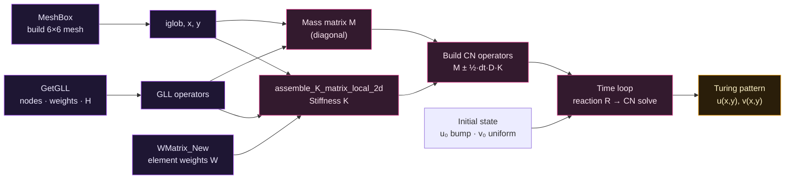

<div align="center">


<br/>

**A high-order 2D spectral-element solver that turns two diffusing chemicals into self-organizing Turing patterns.**

<br/>

[](https://www.mathworks.com/)
[](#-why-spectral-elements)
[](#-numerical-scheme)
[](#-the-science)
[](#-results)

[Overview](#-overview) · [Science](#-the-science) · [Why SEM](#-why-spectral-elements) · [Math](#-the-math) · [Pipeline](#-solver-pipeline) · [Run it](#-getting-started) · [Files](#-file-reference)

</div>

---

## 🧭 Overview

Alan Turing's 1952 insight was that two chemicals — one that activates, one that inhibits — diffusing at *different* rates can spontaneously break symmetry and paint stationary patterns: spots, stripes, labyrinths. This repository solves exactly such a system, the **Schnakenberg** reaction-diffusion model, on a 2D square using the **Spectral Element Method (SEM)** with Gauss–Lobatto–Legendre (GLL) nodes and a **Crank–Nicolson** time march.

The result is the pattern in the banner above: from a nearly-uniform initial state plus a tiny perturbation, the solver grows a field of well-separated spots — a numerical demonstration of morphogenesis.

The domain is discretized into a grid of **6×6 high-order elements**, each carrying a **degree-6** polynomial (7×7 GLL nodes). Because SEM places its quadrature points *at* the GLL nodes, the mass matrix comes out **diagonal** — so every time step is a cheap solve rather than a full inversion.

---

## 🔬 The science

The Schnakenberg model couples an activator $u$ and a substrate $v$:

$$
\frac{\partial u}{\partial t} = D_u\,\nabla^2 u + \gamma\,(a - u + u^2 v),
\qquad
\frac{\partial v}{\partial t} = D_v\,\nabla^2 v + \gamma\,(b - u^2 v)
$$

The nonlinear $u^2 v$ term is the engine: $u$ autocatalytically produces more of itself while consuming $v$. A **Turing instability** appears when the inhibitor diffuses much faster than the activator ($D_v \gg D_u$) — here $D_v/D_u = 20$ — destabilizing the uniform steady state

$$
u^\* = a + b, \qquad v^\* = \frac{b}{(a+b)^2}
$$

into a patterned one. The parameter $\gamma$ sets the domain's size in reaction units and therefore how many spots fit inside it.

---

## ⚡ Why spectral elements

SEM blends the geometric flexibility of finite elements with the accuracy of spectral methods. For a smooth problem like this one, that buys you a lot:

| Property | What it gives you here |
|---|---|
| **High-order GLL basis** ($P=6$) | Spectral (exponential) accuracy per element — few elements, sharp resolution |
| **GLL nodes = quadrature points** | The mass matrix $M$ is **diagonal** (lumped), so no mass-matrix inversion |
| **Tensor-product structure** | The 2D element operators factor into cheap 1D pieces |
| **Element mesh** | Local refinement and complex geometry stay possible |

The cyan grid and clustered node dots in the banner are literally this discretization: 6×6 elements, with GLL nodes bunched toward element edges (as they must be for stability at high order).

---

## 🧮 The math

**Semi-discrete form.** Projecting the PDEs onto the GLL basis gives, for each species,

$$
M\,\dot{U} = -D_u\,K\,U + M\,R_u(U,V), \qquad M\,\dot{V} = -D_v\,K\,V + M\,R_v(U,V)
$$

where $M$ is the diagonal mass matrix, $K$ the stiffness (discrete Laplacian) matrix, and $R_u, R_v$ the nodal reaction terms.

**Time stepping — Crank–Nicolson on diffusion, explicit on reaction.** Treating the stiff diffusion implicitly (second-order, unconditionally stable) and the reaction explicitly yields the linear systems the code actually solves:

$$
\underbrace{\big(M + \tfrac{1}{2}\Delta t\,D_u K\big)}_{A^{\text{left}}_u}\,U^{n+1}
= \underbrace{\big(M - \tfrac{1}{2}\Delta t\,D_u K\big)}_{A^{\text{right}}_u}\,U^{n} + \Delta t\,M\,R_u^{n}
$$

and identically for $V$ with $D_v$. Both left-hand operators are built once, before the loop.

**Global assembly.** The stiffness matrix is assembled element by element from GLL derivative operators $H$ and the geometric Jacobian, using the tensor-product identity that lets a 2D Laplacian be expressed through 1D differentiation in each direction. Redundant nodes shared across element edges are stitched together by the `iglob` local-to-global map.

---

## 🔧 Solver pipeline



---

## 🚀 Getting started

**Requirements:** MATLAB (no toolboxes strictly required). `GetGLL.m` reads pre-tabulated GLL data, so you need a `gll_xwh/` folder next to the scripts containing the node/weight/derivative tables (e.g. `gll_07.tab` for `NGLL = 7`).

```matlab
% From the project folder in MATLAB:
Schnakenberg_model_SEM
```

That single script builds the mesh, assembles the operators, runs the time march, and plots the final $u$ and $v$ fields with `pcolor` + `shading interp`.

> [!IMPORTANT]
> With the shipped settings (`dt = 1e-5`, `T = 2`) the loop runs **200,000 steps**. For a quick look, raise `dt` (Crank–Nicolson stays stable) or lower `T`, then refine once you like the pattern.

> [!TIP]
> The assembly in `assemble_K_matrix_local_2d.m` currently uses a **dense** `Kglob`; a sparse-triplet path is included but commented out. For finer meshes, switch to the `sparse(I,J,V,...)` assembly to keep memory and solve times sane.

---

## 🎛 Parameters

Set at the top of `Schnakenberg_model_SEM.m`:

| Symbol | Code | Value | Meaning |
|---|---|---|---|
| $D_u$ | `D_u` | `0.05` | Activator diffusion |
| $D_v$ | `D_v` | `1` | Substrate diffusion (fast → Turing) |
| $\gamma$ | `gamma` | `100` | Reaction strength / domain scale |
| $a$ | `A` | `0.1305` | Schnakenberg feed |
| $b$ | `B` | `0.7695` | Schnakenberg feed |
| — | `NELX,NELY` | `6, 6` | Elements per direction |
| $P$ | `P` | `6` | Polynomial degree (`NGLL = 7`) |
| $T,\Delta t$ | `T,dt` | `2, 1e-5` | Final time, step size |

---

## 📊 Numerical scheme

| Ingredient | Choice |
|---|---|
| Spatial discretization | Spectral elements, GLL nodes, $P=6$ |
| Mass matrix | Diagonal (GLL-lumped) |
| Diffusion in time | Crank–Nicolson (implicit, 2nd order) |
| Reaction in time | Explicit (IMEX splitting) |
| Linear solve | Direct backslash on prebuilt CN operators |
| Initial condition | Uniform steady state + localized Gaussian bump in $u$ |

---

## 🗂 File reference

| File | Role |
|---|---|
| `Schnakenberg_model_SEM.m` | Main driver — parameters, assembly, time loop, plotting |
| `MeshBox.m` | Builds the SEM mesh; returns `iglob` map and node coordinates, handling shared edge nodes |
| `GetGLL.m` | Loads GLL points, quadrature weights, and Lagrange-derivative matrix `H` from `gll_xwh/` tables |
| `assemble_K_matrix_local_2d.m` | Assembles the global stiffness (Laplacian) matrix from element operators |
| `WMatrix_New.m` | Per-element property array `W` (here uniform GLL weights) — the hook for spatially varying diffusion |

---

## 🖼 Results

<div align="center">


<br/>
<sub>Activator concentration <i>u(x, y)</i> at steady state — spots emerging from a near-uniform start.</sub>

</div>

<br/>

> The image above is a reference reaction-diffusion field in the Schnakenberg regime. Drop your own `pcolor` exports into `assets/` to showcase the solver's actual output for $u$ and $v$.

---

## 🧠 Notes & extensions

- **Spatially varying diffusion** — `WMatrix_New` is where you'd encode heterogeneous media; give each element (or node) its own weight instead of a uniform `wgll2`.
- **Different patterns** — sweep $\gamma$ for more/fewer spots, or push $a,b$ toward the stripe regime.
- **Bigger domains** — switch stiffness assembly to sparse and consider a factorization (`decomposition`/`chol`) of the CN operators, since they're constant across the march.

---

## 📚 References

- A. M. Turing (1952). *The Chemical Basis of Morphogenesis.* Phil. Trans. R. Soc. B.
- J. Schnakenberg (1979). *Simple chemical reaction systems with limit cycle behaviour.* J. Theor. Biol.
- Spectral Element Method: G. E. Karniadakis & S. J. Sherwin, *Spectral/hp Element Methods for CFD.*

<div align="center">
<br/>
<sub>Diffuse. React. Self-organize.</sub>
</div>
